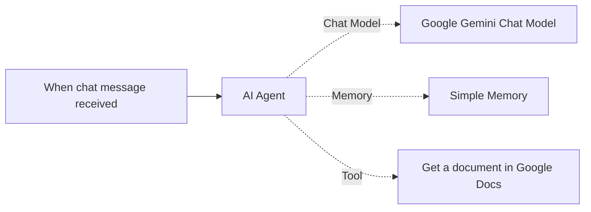

# IIST Admission Website with Chatbot

A responsive single-page admission portal for **IIST (Indian Institute of Space Science and Technology)**, built using HTML, CSS, and JavaScript.

This project includes:
- Admission-focused landing page (Programs, Eligibility, Important Dates, Apply)
- Enquiry form with front-end validation
- Mobile-friendly navigation
- Integrated n8n chat window chatbot

## Project Structure

```text
VScode_agent/
├── index.html
├── style.css
├── script.js
└── README.md
```

## Features

- Clean admission portal UI
- Responsive layout for desktop and mobile
- Interactive admission enquiry form
- Dynamic current year in footer
- Embedded chatbot using `@n8n/chat`

## Architecture

The chatbot automation follows this n8n flow:



### Flow Summary

- **Trigger:** New message received from website chat widget
- **AI Agent:** Central reasoning/orchestration node
- **Model:** Google Gemini Chat Model for response generation
- **Memory:** Simple Memory for conversation context
- **Tool:** Google Docs retrieval tool for document-based answers

## Tech Stack

- HTML5
- CSS3
- JavaScript (Vanilla JS)
- n8n Chat Web SDK (CDN)

## Run Locally

Since this is a static website, you can run it directly:

1. Open `index.html` in your browser

Or run with a local server (recommended):

```bash
# Python
python -m http.server 5500
```

Then open:

`http://localhost:5500`

## Chatbot Configuration

The chatbot is initialized in `index.html` using:

- CDN script for `@n8n/chat`
- `createChat({...})` config
- Your webhook URL

If you want to change chatbot behavior, edit:
- Initial messages
- Title/subtitle text
- Webhook URL

inside the chat initialization block in `index.html`.

## How to Push to GitHub

```bash
git init
git add .
git commit -m "Initial commit: IIST admission website with chatbot"
git branch -M main
git remote add origin <your-repo-url>
git push -u origin main
```

## Notes

- Form submission is currently front-end only (no backend database/email service connected).
- You can connect a backend API later for real admissions data handling.

## Author

Bhavesh
